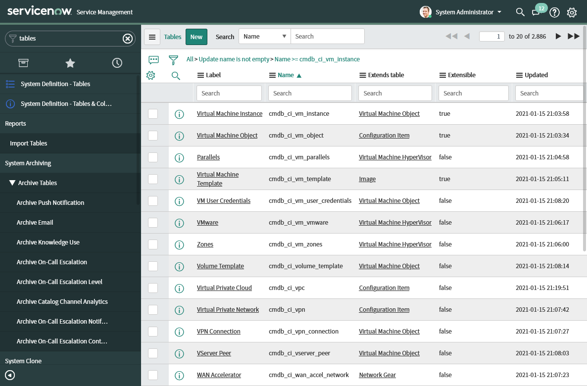
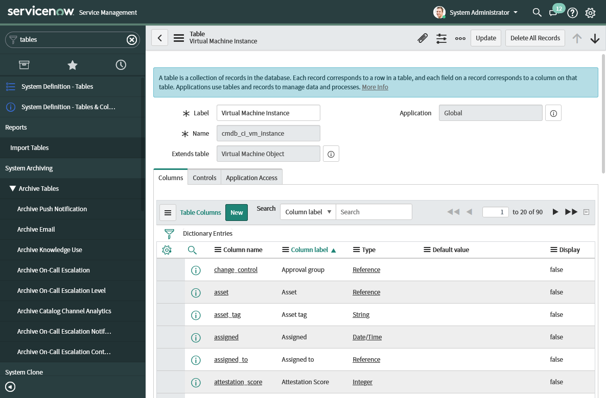
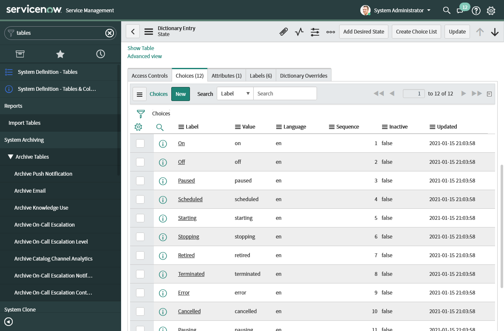
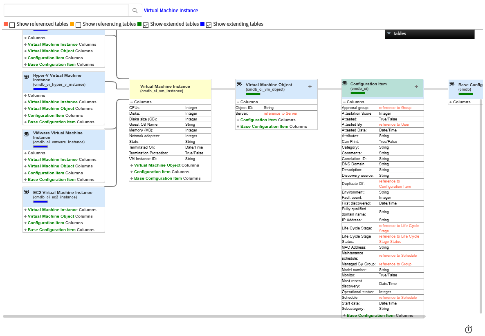

# Finding available record columns

Since ServiceNow tables are extensible, modules from the ServiceNow Ansible
Collection only document commonly-used ones. Ansible users can still pass
arbitrary data to ServiceNow through the `other` parameter available on every
module.

This document will describe two ways of inspecting the ServiceNow table schema
and show you how this information maps to module parameters.

## Tables view

We can retrieve the information about table schemas by navigating to the
*System Definition* -> *Tables* section. After we find the table we are
interested in (hint: there is a search field near the top of the application),
we can click on it, and ServiceNow will take us to the table's definition.

Once the table view loads, we will find a list of columns at the bottom of the
application. This list will contain (among other things) a column name. And
this name is what we can use as a key in the `other` parameter.

If we click on the column, we can also learn about any restrictions on column
values. For example, in the screenshot below, we can see the `state` column's
valid values.

## Schema map

We can get the same information from the schema map. Once we navigate to the
*System Definition* -> *Tables & Columns* section, select a table, and click
the *Schema map* button, ServiceNow will open a new window with a schema map.

If we want to get information about a particular column, we can click on it,
and ServiceNow will again open the window that contains information about
column name and restrictions.
