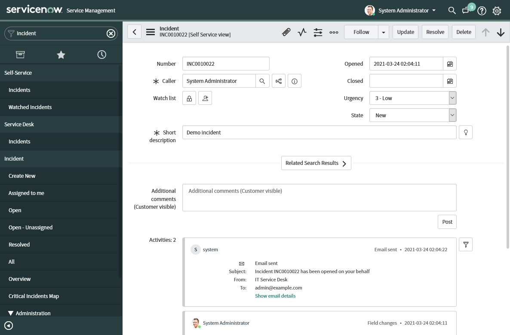

# Incident management

The incident, problem, and change request modules from the ServiceNow ITSM
Ansible collection allow us to automate the incident resolution process. In
this document, we will go through all the resolution process steps using
ServiceNow ITSM modules.


## Creating an incident ticket

We will kick off the process by creating a new incident ticket. In the Ansible
world, this translates to the following task:

    - name: Create new incident
      servicenow.itsm.incident:
        caller: admin
        state: new
        short_description: Demo incident
        impact: low
        urgency: low
      register: incident

Once the job completes, we will find something similar to the following in our
ServiceNow instance:



Great, now we can start solving the mystery.


## Adding a problem ticket

Instead of directly solving the incident, we will pretend that users reported
several incidents with a common root cause. In such situations, creating a
problem ticket is the next step we usually take. In the Ansible language, this
translates to the following two tasks:

    - name: Create a problem from incident
      servicenow.itsm.problem:
        short_description: Demo problem
      register: problem

    - name: Update incident with a problem information
      servicenow.itsm.incident:
        number: "{{ incident.record.number }}"
        state: in_progress
        other:
          problem_id: "{{ problem.record.sys_id }}"

One thing to note here is that the second task will only modify the record
fields that we used as task parameters. All other information is retained,
except for some housekeeping information that ServiceNow updates automatically.

If we run the `ansible-playbook` with the `--diff` command-line switch, Ansible
will also report back what exactly changed. In our case, the output would look
something like this:

```diff
TASK [Update incident with a problem information] ***************************
--- before
+++ after
@@ -50,7 +50,7 @@
     "parent": "",
     "parent_incident": "",
     "priority": "5",
-    "problem_id": "",
+    "problem_id": "fc27a896074f2010d4a1fa9e7c1ed081",
     "reassignment_count": "0",
     "reopen_count": "0",
     "reopened_by": "",
@@ -71,10 +71,10 @@
     "sys_domain": "global",
     "sys_domain_path": "/",
     "sys_id": "2396e496074f2010d4a1fa9e7c1ed01c",
-    "sys_mod_count": "0",
+    "sys_mod_count": "1",
     "sys_tags": "",
     "sys_updated_by": "admin",
```

Now that we have our problems written down, we can start solving them.


## Creating a change request

The change request is the last piece of the puzzle that we need to fix the
issue. Once we assign someone to the problem, that person will assess the
problem ticket and create a new change request based on the findings. As
before, this translates to a few playbook tasks that look something like the
following listing:

    - name: Assign problem for assessment
      servicenow.itsm.problem:
        sys_id: "{{ problem.record.sys_id }}"
        state: assess
        assigned_to: problem.manager

    - name: Create change request for resolving a problem
      servicenow.itsm.change_request:
        state: new
        type: standard
        short_description: Demo change request
        template: Clear BGP sessions on a Cisco router - 1
        other:
          parent: "{{ problem.record.sys_id }}"
      register: change

    - name: Mark the problem for root cause analysis
      servicenow.itsm.problem:
        number: "{{ problem.record.number }}"
        state: root_cause_analysis
        cause_notes: Write the analysis notes here. The more, the better ;)
        other:
          rfc: "{{ change.record.sys_id }}"

Notice how we once again linked the relevant records together. We will talk a
bit more about why this is important in the next section.


## Resolving the root problem

Now that we know what we need to do to fix the problem, we are just a few
Ansible tasks away from a fully-resolved incident. And Ansible is a perfect fit
for this last part of the process. Performing standard changes in a repeatable
manner is why Ansible exists.

    - name: Start fixing the problem
      servicenow.itsm.problem:
        sys_id: "{{ change.record.parent }}"
        state: fix_in_progress
        fix_notes: Detailed fix description here.

    - name: Schedule changes
      servicenow.itsm.change_request:
        number: "{{ change.record.number }}"
        state: scheduled
        assignment_group: network

    - name: Start implementing changes
      servicenow.itsm.change_request:
        number: "{{ change.record.number }}"
        state: implement

    - name: Simulate the fix
      ansible.builtin.debug:
        msg: Applying requested changes

    - name: Put changes through review
      servicenow.itsm.change_request:
        number: "{{ change.record.number }}"
        state: review

    - name: Close change request
      servicenow.itsm.change_request:
        number: "{{ change.record.number }}"
        state: closed
        close_code: successful
        close_notes: Testing production systems indicate that the fix worked.

    - name: Close associated problem
      servicenow.itsm.problem:
        sys_id: "{{ change.record.parent }}"
        state: closed
        resolution_code: fix_applied

In the code listing above, we simulated the fix with a debug task. When used in
a real-world scenario, we would replace the `ansible.builtin.debug` module with
the `ansible.builtin.include_role` call. And if we would fully embrace the
automation, we could retrieve the role name directly from the change request.

Did you notice that we only used information from the change request record in
the last Ansible playbook listing? Because we previously linked our problem and
change request, getting references is as easy as referencing a variable in the
Ansible playbook.
